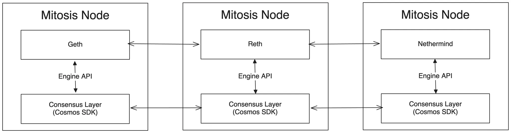

<div align="center">
  
  
  # Mitosis Chain
  **⚡ Next-Generation Modular Blockchain Infrastructure**
  
  [](LICENSE)
  [](https://goreportcard.com/report/github.com/mitosis-org/chain)
  [](https://github.com/mitosis-org/chain/actions)
  [](https://github.com/mitosis-org/chain/actions)
  
  [🚀 Quick Start](#-quick-start) • 
  [📖 Documentation](https://docs.mitosis.org) • 
  [💬 Community](#-community) • 
  [🎯 Roadmap](#-roadmap) •
  [🤝 Contributing](CONTRIBUTING.md)
</div>

---

## ✨ Why Mitosis Chain?

<table>
<tr>
<td width="33%" align="center">

### 🔧 **Developer-First**
Full EVM compatibility with Cosmos SDK power. Run your Ethereum dApps without changes while leveraging advanced Cosmos features.

</td>
<td width="33%" align="center">

### ⚡ **High Performance**
Modular architecture separates execution from consensus. Optimized for DeFi and cross-chain operations with minimal latency.

</td>
<td width="33%" align="center">

### 🛡️ **Battle-Tested**
Built on proven technologies: Cosmos SDK, CometBFT, and EVM. Security-focused design with regular audits.

</td>
</tr>
</table>

## 🚀 Quick Start

### One-Line Installation

#### Install Mitosis Chain Node (mitosisd)
```bash
# Latest mitosisd (blockchain node)
curl -sSL https://raw.githubusercontent.com/mitosis-org/chain/main/scripts/install.sh | bash

# Specific version
VERSION=v1.0.0 curl -sSL https://raw.githubusercontent.com/mitosis-org/chain/main/scripts/install.sh | bash
```

#### Install Mito CLI (validator management)
```bash
# Latest mito CLI
COMPONENT=mito curl -sSL https://raw.githubusercontent.com/mitosis-org/chain/main/scripts/install.sh | bash

# Specific version
COMPONENT=mito VERSION=v1.0.0 curl -sSL https://raw.githubusercontent.com/mitosis-org/chain/main/scripts/install.sh | bash
```

### Manual Installation

#### For Mitosis Chain Node (mitosisd)
```bash
# Download latest mitosisd release (vX.Y.Z)
wget https://github.com/mitosis-org/chain/releases/latest/download/mitosisd-linux-amd64
chmod +x mitosisd-linux-amd64 && mv mitosisd-linux-amd64 /usr/local/bin/mitosisd

# Initialize and start node
mitosisd init my-node --chain-id mitosis-mainnet-1
mitosisd start
```

#### For Mito CLI
```bash
# Download latest mito CLI release (mito/vX.Y.Z)
wget $(curl -s https://api.github.com/repos/mitosis-org/chain/releases | grep browser_download_url | grep mito/v | grep linux-amd64 | head -n1 | cut -d'"' -f4)
chmod +x mito-linux-amd64 && mv mito-linux-amd64 /usr/local/bin/mito

# Configure and use
mito config set-rpc https://rpc.mitosis.org
mito version
```

### Using Docker
```bash
# Run Mitosis Chain Node (mitosisd only)
docker run -p 26657:26657 -p 8545:8545 ghcr.io/mitosis-org/chain:latest
```

## 🏗️ Architecture

### Overview


Mitosis Chain employs a **modular architecture** that separates execution from consensus, providing the best of both Ethereum and Cosmos ecosystems.

<details>
<summary><b>🔍 Detailed Architecture</b></summary>

- **Execution Layer**: Fully EVM-compatible, enabling unmodified Ethereum execution clients
- **Consensus Layer**: Built upon Cosmos SDK with CometBFT for Byzantine fault tolerance
- **Communication**: Uses [Engine API](https://hackmd.io/@danielrachi/engine_api) via [Octane](https://github.com/omni-network/omni/tree/main/octane)
- **Design Philosophy**: Keep consensus layer thin, implement logic in EVM smart contracts

</details>

### Validator & Governance System

Unlike traditional Cosmos chains, Mitosis implements **most logic as EVM smart contracts**:

| Component | Traditional Cosmos | Mitosis Chain |
|-----------|-------------------|---------------|
| Staking | `x/staking` module | EVM Smart Contract |
| Delegation | `x/staking` module | EVM Smart Contract |
| Rewards | `x/distribution` module | EVM Smart Contract |
| Governance | `x/gov` module | EVM Smart Contract |

**Benefits:**
- 🎯 **Unified Development**: Single language (Solidity) for all logic
- ⚡ **Better UX**: Standard Ethereum tooling and wallets
- 🔄 **Easier Upgrades**: Contract upgrades vs. chain upgrades

### Core Modules

<table>
<tr>
<td>

#### `x/evmengine` (forked from Octane)
- Communicates with execution client via Engine API
- Wraps EVM blocks into consensus transactions
- Seamlessly integrates with other modules

</td>
<td>

#### `x/evmvalidator`
- Manages validator set from EVM contract state
- Lightweight replacement for `x/staking`
- Integrates with `x/slashing` and `x/evidence`

</td>
<td>

#### `x/evmgov`
- Enables arbitrary message execution from EVM
- Governance parameters controlled by smart contracts
- Minimal overhead compared to `x/gov`

</td>
</tr>
</table>

## 🛠️ Development

### Prerequisites

- **Go 1.21+**
- **Node.js 18+** (for tooling)
- **Docker** (for devnet)
- **Git** with submodules

### Setup Development Environment

```bash
# Clone repository
git clone https://github.com/mitosis-org/chain.git
cd chain

# Fetch submodules
git submodule update --init --recursive

# Build binaries
make build

# Run tests
make test
```

### Network Environments

| Environment | Purpose | Chain ID (EVM) | Chain ID (Cosmos) |
|-------------|---------|----------------|-------------------|
| **Localnet** | Local development | `124899` | `mitosis-localnet-1` |
| **Devnet** | Integration testing | `124864` | `mitosis-devnet-1` |
| **Testnet** | Public testing | TBD | TBD |
| **Mainnet** | Production | TBD | TBD |

<details>
<summary><b>📋 Localnet Setup</b></summary>

```bash
# Setup execution client
make setup-geth  # or make setup-reth
make run-geth

# Setup consensus client
make setup-mitosisd
make run-mitosisd

# Deploy contracts (in protocol repo)
./tools/deploy-consensus-entrypoints.sh

# Update contract addresses
./build/midevtool governance execute \
  --entrypoint 0x06c9918ff483fd88C65dD02E788427cfF04545b9 \
  --private-key 0x5a496832ac0d7a484e6996301a5511dbc3b723d037bc61261ecaf425bd6a5b37 \
  --msg '[{"@type":"/mitosis.evmvalidator.v1.MsgUpdateValidatorEntrypointContractAddr","authority":"mito1g86pactsvfrcglkvqzvdwkxhjshafu280q95p7","addr":"0x9866D79EF3e9c0c22Db2b55877013e13a60AD478"}]'
```

</details>

<details>
<summary><b>🐳 Devnet Setup</b></summary>

```bash
# Build Docker image
make devnet-build

# Initialize chain
make devnet-init

# Start all services
make devnet-up

# Check status
docker logs mitosis-devnet-node-mitosisd-1
cast block-number --rpc-url http://localhost:18545

# Create validator
make devnet-create-validator

# Stop and clean
make devnet-down
make devnet-clean
```

</details>

## 🔧 Tools & CLI

### MITO CLI

Powerful command-line interface for validator operations and blockchain interaction.

```bash
# Install
go install github.com/mitosis-org/chain/cmd/mito@latest

# Configure
mito config set-rpc https://rpc.mitosis.org
mito config set-contract --validator-manager 0xECF7658978A03b3A35C2c5B33C449D74E8151Db0

# Create validator
mito tx send validator create \
  --pubkey 0x1234... \
  --operator 0x5678... \
  --commission-rate 5% \
  --initial-collateral 1.5 \
  --account my-validator

# Query validator
mito query validator info --address 0x1234...
```

[📖 **Full CLI Documentation**](cmd/mito/README.md)
## 🤝 Contributing

We welcome contributions from the community! Check out our [Contributing Guide](CONTRIBUTING.md) to get started.

### Ways to Contribute

- 🐛 **Report bugs** via [GitHub Issues](https://github.com/mitosis-org/chain/issues)
- ✨ **Suggest features** via [GitHub Discussions](https://github.com/mitosis-org/chain/discussions)
- 📚 **Improve documentation** (great for first-time contributors!)
- 🧪 **Write tests** and improve test coverage
- 🔍 **Security research** via our [Security Policy](SECURITY.md)

### Development Workflow

1. **Fork** the repository
2. **Create** a feature branch (`git checkout -b feature/amazing-feature`)
3. **Commit** your changes (`git commit -m 'feat: add amazing feature'`)
4. **Push** to the branch (`git push origin feature/amazing-feature`)
5. **Open** a Pull Request

## 💬 Community

<table>
<tr>
<td align="center">

### 💭 **Discord**
Real-time discussions<br/>
*Coming Soon*

</td>
<td align="center">

### 🐦 **Twitter**
Updates & announcements<br/>
*Coming Soon*

</td>
<td align="center">

### 📝 **GitHub**
Code & issues<br/>
[mitosis-org/chain](https://github.com/mitosis-org/chain)

</td>
<td align="center">

### 📖 **Docs**
Technical documentation<br/>
[docs.mitosis.org](https://docs.mitosis.org)

</td>
</tr>
</table>

## 📝 License

This project is licensed under the [Apache License 2.0](LICENSE).

```
Copyright 2024 Mitosis Labs

Licensed under the Apache License, Version 2.0 (the "License");
you may not use this file except in compliance with the License.
```

## 🙏 Acknowledgments

Special thanks to:
- [Cosmos SDK](https://github.com/cosmos/cosmos-sdk) team for the robust blockchain framework
- [CometBFT](https://github.com/cometbft/cometbft) for Byzantine fault-tolerant consensus
- [Octane](https://github.com/omni-network/omni/tree/main/octane) for EVM-Engine API integration
- All our [contributors](https://github.com/mitosis-org/chain/graphs/contributors) 🚀

---

<div align="center">

**[⭐ Star this repo](https://github.com/mitosis-org/chain) • [🍴 Fork it](https://github.com/mitosis-org/chain/fork) • [🚀 Deploy it](https://docs.mitosis.org/deploy)**

*Built with ❤️ by the Mitosis community*

</div>
