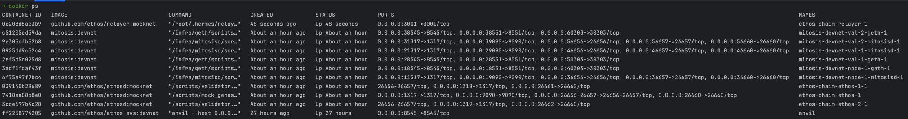

# Devnet

Devnet is for development and testing with complete form of the components. \
It runs not only a mitosis chain, but also external components: an ethos chain, an eigenlayer, and a IBC relayer.

## Chain IDs
- Chain ID (EVM): `25559`
- Chain ID (Cosmos SDK): `mitosis-devnet-1`
- Native Currency on EVM: `MITO`
- Default Denom on Cosmos Side: `thai`

## Primary Endpoints for Mitosis Chain
- EVM RPC: http://localhost:18545
- Cosmos RPC: http://localhost:36657
- More details are in [docker-compose.devnet.yml](./docker-compose.devnet.yml).

## Components
- **Anvil**
  - It mocks ethereum chain.
  - Eigenlayer and ethos avs contracts are deployed on here.
- **Ethos Chain**
  - It consists of 3 validators.
- **Mitosis Chain**
  - It consists of 3 full nodes and two of them are validators.
  - One full node consists of `geth` and `mitosisd`.
- **IBC relayer**
  - It is a hermes IBC relayer to connect an ethos chain and a mitosis chain.

## Setup

It could be much harder to setup devnet than localnet because it runs so many components. \
All components are running in docker containers using `docker-compose`.

Overall steps are:
1. Run `anvil` which is mocking ethereum chain and setup eigenlayer and ethos avs.
2. Setup ethos chain and run ethos validators.
3. Setup and run a mitosis chain.
4. Run IBC relayer to connect an ethos chain and a mitosis chain.

The order of the steps above is important. You should run them in the order.

There are instructions for each step below. \
Make sure a current directory is root directory of the repository before following instructions.

### 1. Run `anvil` and setup eigenlayer and ethos avs.

```bash
# Make sure you have fetched the submodules before through `git submodule update --init --recursive`.
cd ethos/ethos-avs

# Build necessary things
make docker-build-anvil-devnet-with-operators

# Run anvil and setup eigenlayer and ethos avs properly
make docker-start-anvil-devnet-with-operators

# Wait until a registration of ethos avs operators is done.
# `register_operator-test` container terminates after the registration is done.
docker logs -f register_operator-test

# Check the operator registration was successful.
make cli-print-active-delegations
```

Expected output of `make cli-print-active-delegations`:
```
== Logs ==
  Delegation 0
  Operator: 0x21FAB04aAFccF492c3b5e9019DC26f10aBbA0713
  Consumer chain: mitosis-devnet-1
  Delegated validator public key: 02B0409DA75FA8D1B675B0EFA9055F93E62CC74AC554EA8BC4F38CC189C21AE8
  Delegated validator address: mitovaloper1l20lr7a8very8fetgk4fz220zwaftyt9k77pvq
  Stake: 100
  =====================================
  Delegation 1
  Operator: 0x860B6912C2d0337ef05bbC89b0C2CB6CbAEAB4A5
  Consumer chain: mitosis-devnet-1
  Delegated validator public key: D499B5EF050CAB9C2228BD69B7BC4C4BEEBC744393D4AC4F5DAD1C2C376D235D
  Delegated validator address: mitovaloper1hkn624em7xp5kcjehxdh49z7m0f6scxvda5u0h
  Stake: 100
  =====================================
```

You can stop `anvil` and reset existing data by running the following command:
```bash
cd ethos/ethos-avs

make docker-remove-anvil-devnet-with-operators
```

### 2. Setup ethos chain and run ethos validators.

```bash
cd ethos/ethos-chain

# Build necessary things
make devnet-build

# Run validators for ethos chain
make devnet-up

# Check the status of the validators
docker logs -f ethos-chain-ethos-1
```

You can stop ethos chain and reset existing data through the following commands:
```bash
cd ethos/ethos-chain

# It stops the validators.
# You can start them again with keeping existing data through `make devnet-up`.
make devnet-down

# It removes all data of the validators.
make devnet-clean
```

### 3. Setup and run a mitosis chain.

```bash
# Build necessary things
make devnet-build

# Init a mitosis chain.
# It registers a mitosis chain to an ethos chain and makes a genesis file for the mitosis chain.
# Note that the registration is performed through a tx on the ethos chain.
make devnet-init

# Run nodes for a mitosis chain.
make devnet-up

# Check the status of the nodes.
docker logs mitosis-devnet-node-1-mitosid-1
docker logs mitosis-devnet-node-1-geth-1

# Check geth rpc is working properly.
cast block-number --rpc-url http://localhost:18545
# You can use `curl` instead if `cast` is not installed.
curl -H "Content-Type: application/json" --data '{"jsonrpc":"2.0","method":"eth_blockNumber","params":[],"id":25559}' http://localhost:18545
```

You can stop mitosis chain and reset existing data through the following commands:
```bash
# It stops the nodes.
# You can start them again with keeping existing data through `make devnet-up`.
make devnet-down

# It removes all data of the nodes.
# It also removes the initialization data which is created by `make devnet-init`.
make devnet-clean

# If you want to remove data except the initialization data, you can use the following command.
rm -rf tmp/devnet/node-* tmp/devnet/val-*
```

### 4. Run IBC relayer to connect an ethos chain and a mitosis chain.

```bash
cd ethos/ethos-chain

make devnet-relayer-build
make devnet-relayer-up

# Check the status of the relayer
docker logs -f ethos-chain-relayer-1
```

You can stop IBC relayer and reset existing data through the following commands:
```bash
cd ethos/ethos-chain

# It stops the relayer.
make devnet-relayer-down

# It removes all data of the relayer.
make devnet-relayer-clean
```

If you reset the data of a mitosis chain, you should reset the data of an ethos chain too. \
If not, a relayer might not work properly.

### Enjoy your devnet!

Finally, you can see the list of running docker containers through `docker ps`:

